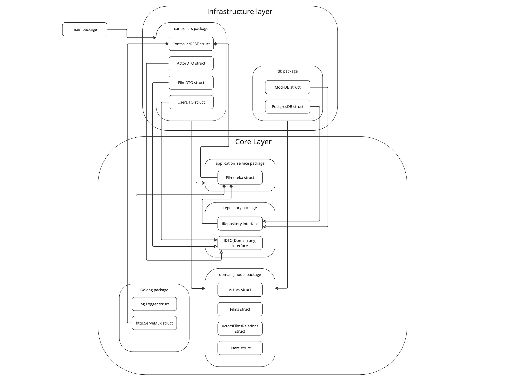

# Filmoteka

### This application is a web service to store films information and actors starred there in database, providing REST API to communicate with it by HTTP protocol

## Arcitecture
The wep application architecture include 2 main layers: Core and Infrastructure. Core is lower than Infrastructure, so code from Infrastructure can call code of Core but not vice versa.

* `domain_model` package contain structs that presents all key entities of the application
* `repository` package contain `IRepository` interface to make possible implement database communication indepedently. `IDTO` template interfasce is used to indepedent communication of controllers with application_service
* `application_servece` package contain `Filmoteka` struct that present main logic of web service. It works with `IRepository` object. So, any object that represents database and satisfies `IRepository` can be passed here.
* `db` package contains `MockDB` for testing and `PostgresDB` as general vault. They both implements `IRepository` interface
* `controllers` package contents `DTO`s structures. These structures implements `IDTO` interface to transfer data from controller to `application_servece`. Here can be various controllers. Now is implemented REST controller `ControllerREST`. It contains `Filmoteka` object and call its methods.

## Run
There are implemented some commands in Makefile
* `Make test` - run tests
* `Make run` - will try to up docker-compose with web application

Application will listen `127.0.0.1:8888`

> Some functional can be not implemented yet (
